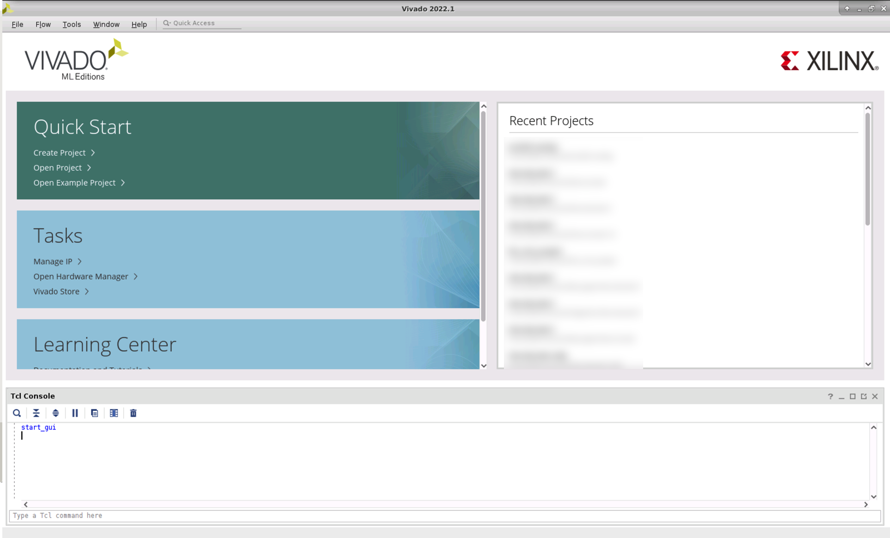
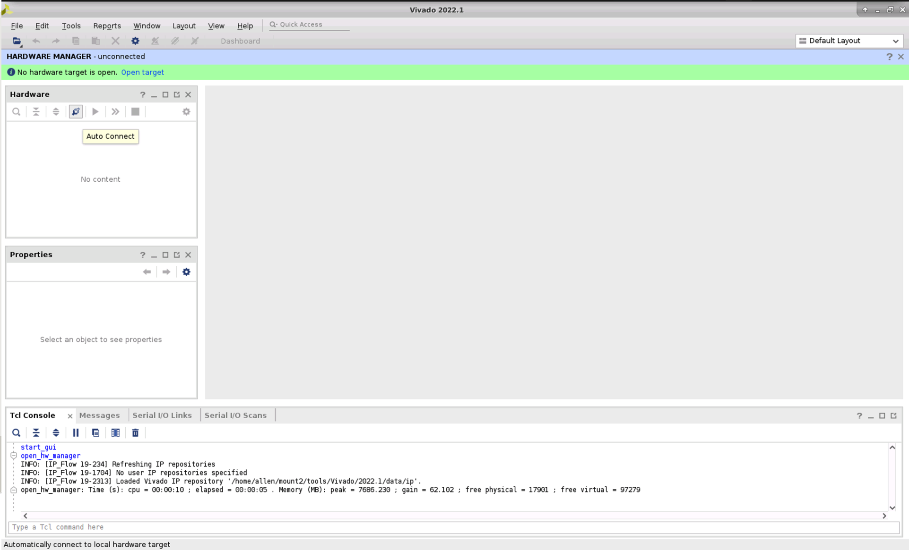
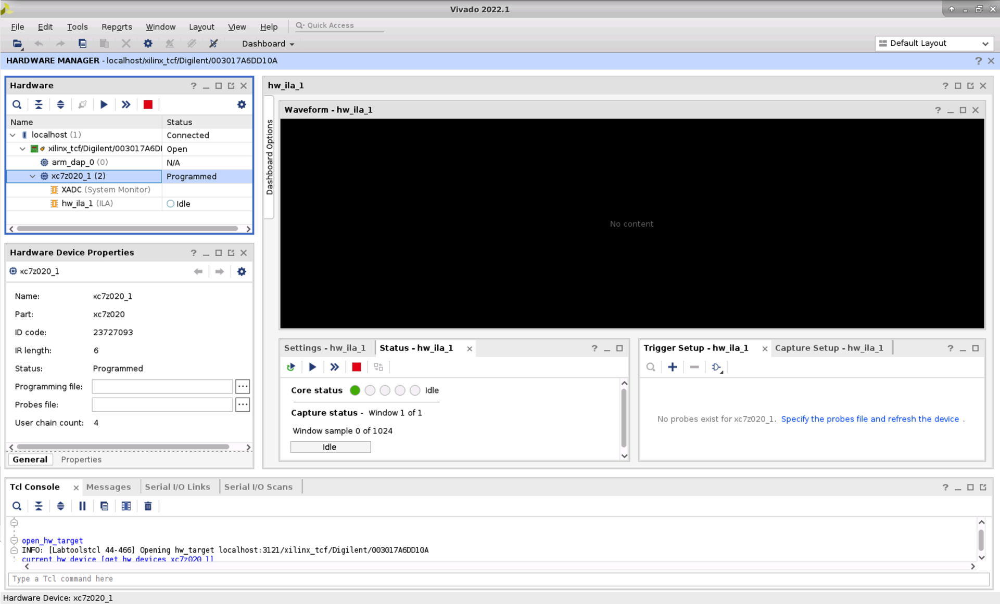
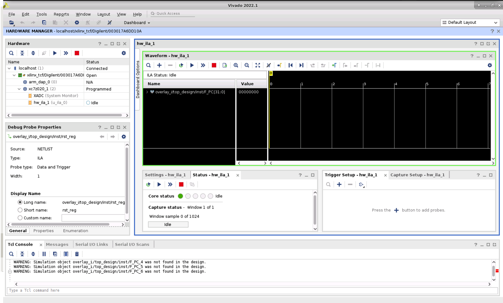
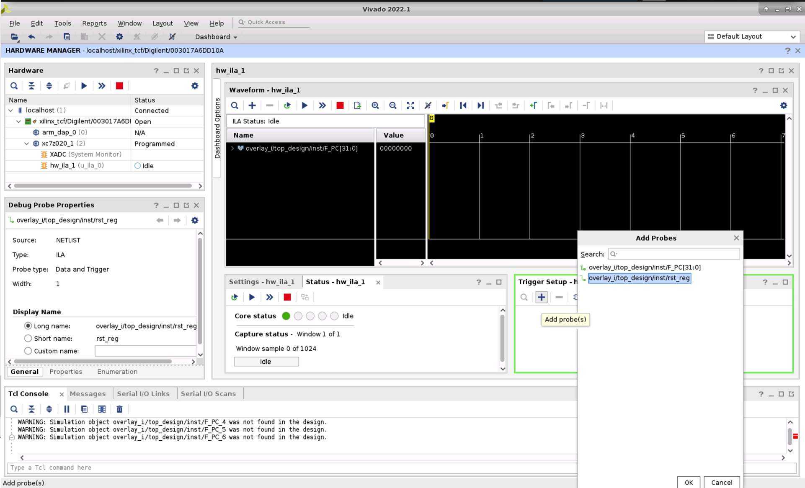
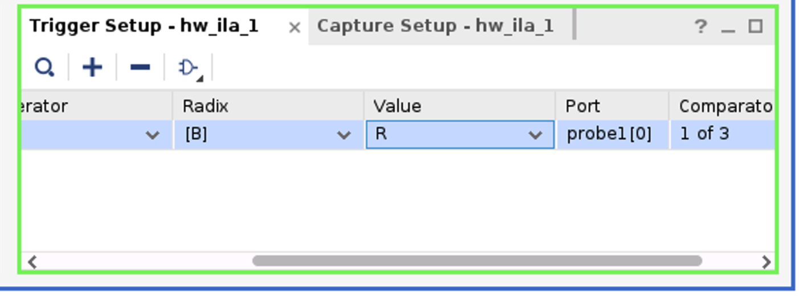
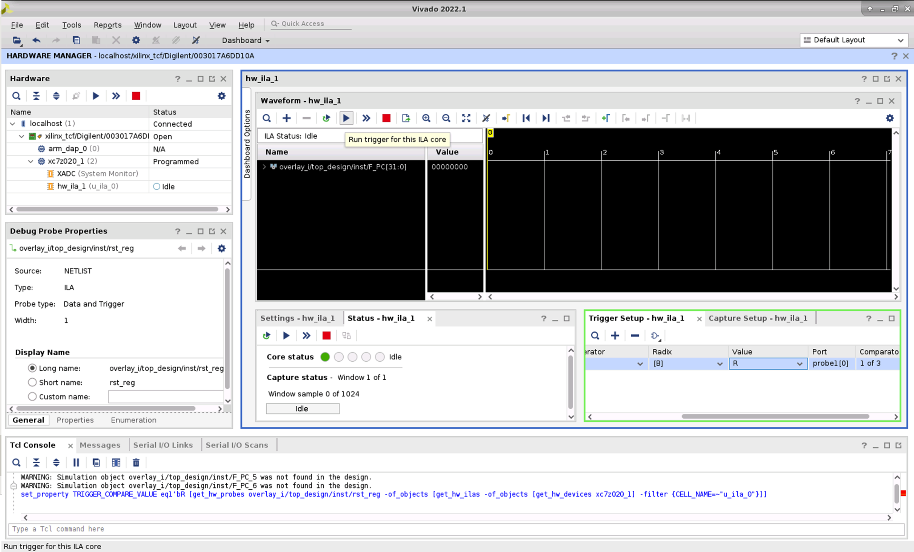
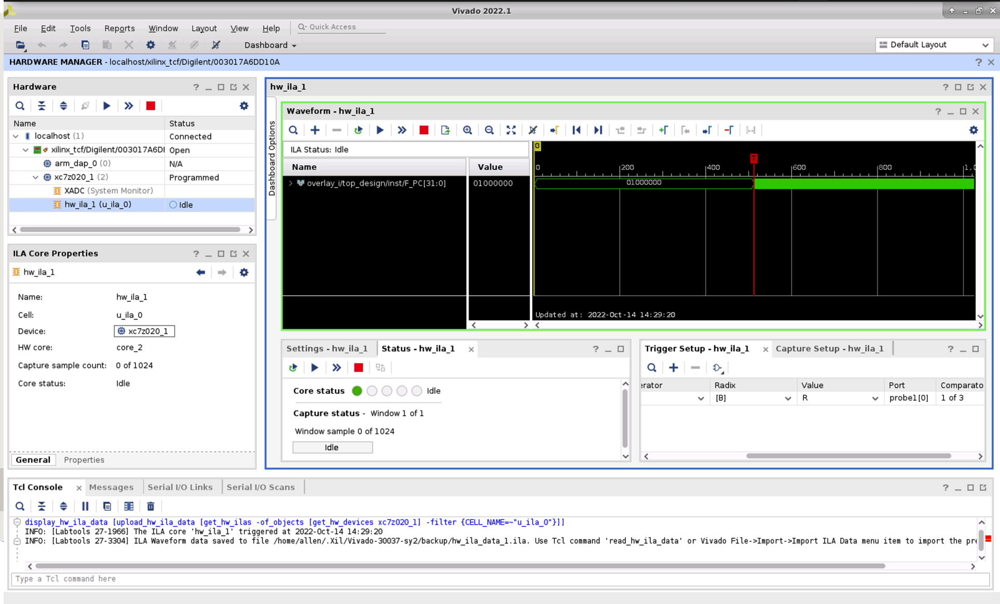
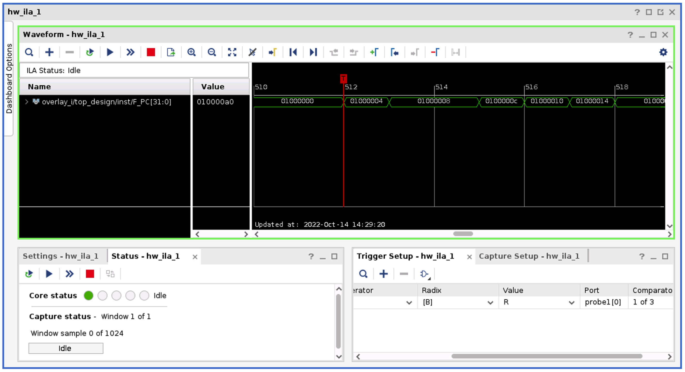

# PD6: Running the 5-Stage Pipeline on an FPGA

This document will guide you through mapping your PD5 design to FPGA hardware.

**Deadline**: Monday, December 2, 2024 at 11:59 PM

**Weight**: 25% of total lab grade

## Environment Setup

### Getting the repository

Use `git` to clone the repository to your Linux environment.
This can be done using:

```bash
git clone ist-git@git.uwaterloo.ca:ece320-f24/project/a6shahri-pd6.git
```

### Setup of simulators and environment variables

Go to the root of the project repository and execute the command `source env.sh` (use the `-l` flag if running locally).
You should get the information similar to the following.
Note that you will need to perform this operation every time you use a different `bash` session.
Otherwise, the scripts will not be able to locate the files.

```bash
$ source env.sh
===== Computer Architecture Course Environment Setup =====
Important: this script should be used as `source env.sh [-l]` and should only be used in bash
Project Root ($PROJECT_ROOT):		/home/your/path/to/repo
verilator Version ($VERILATOR_VERSION):	 Verilator 4.210 2021-07-07 rev v4.210
Vivado Version ($VIVADO_VERSION): 	 Vivado v2022.1 (64-bit)
===== Computer Architecture Course Environment Done  =====
```

If the script is unable to locate the verilator or vivado version, the corresponding line will be empty.
If you are using `eceubuntu`, note that not all machines have vivado.
If you run `env.sh` and it does not find vivado, try to connect to a different machine.

## Specification
The following description can also be found in the project-deliverables.pdf document on LEARN.

You will take your design from PD5, and implement your core on an FPGA.
You will then run programs on your core on the FPGA.
You will use Vivado to generate the bitstream for your core.
Specifically, you will implement your design on the PYNQ-Z1 FPGA board, which you may have seen if you have visited the lab.
**Please go over the whole PD6 README before working on any of its tasks.**

Start by copying your design from PD5 to PD6, including `verif/scripts/design.f` and all Verilog designs, except for `imemory.v` and `dmemory.v`.
We provide you with these memory module implementations for PD6.

## Probes

You will need to fill in `design/signals.h` with your signal names in `design/code/pd.v` to wire up the probes.
There are two new probes in PD6.
You will need to specify the instance names of your `imemory` and `dmemory` modules.

```verilog
`define IMEMORY             ???
`define DMEMORY             ???
```

## A Brief Introduction to FPGA Design

We present a brief overview of the necessary steps in getting your core to work on the FPGA.
For more information, refer to [this document](https://www.xilinx.com/content/dam/xilinx/support/documents/sw_manuals/xilinx2022_1/ug949-vivado-design-methodology.pdf) for a more complete picture including other important concepts in FPGA development such as system-level
integration and specifying constraints.
1. **RTL development**: The process of defining the modules and logic in Verilog code in previous PDs.
2. **Logic simulation and verification**: The process of simulating and verifying your design by running it using verilator.
3. **Logic synthesis**: The process of transforming an RTL design into a gate-level representation.
Specifically for FPGAs, it corresponds to mapping the RTL design onto LUTs, registers, memories, and IOs to generate a netlist.
1. **Implementation (place and route)**: For FPGAs, the implementation is the process of mapping the synthesized netlist onto a specific device, including the process of placement and routing for a specific FPGA chip type.
The implementation step is also known as P&R or PNR.
We use these terms interchangeably in this PD.
1. **Bitstream generation**: The implemented design is converted into a stream of ones and zeros called the bitstream, which is simply a file that can be programmed onto the FPGA.

Before attempting PD6, you should have completed steps 1 and 2 above.

## Procedure

### Mapping Verilog to Appropriate FPGA Resources
You need to ensure that elements in your design, i.e. modules and wires in your Verilog code, map to appropriate resources on the FPGA.
Generally, an FPGA contains four types of resources: 
1. Programmable logic
2. Memory resources
3. Routing resources
4. I/O resources

In this PD, we focus mostly on the (1) programmable logic, that implements combinational and synchronous logic, and (2) memory resources, that implements storage such as arrays in Verilog.
Programmable logic includes lookup tables (LUTs) and flip-flops (FFs).
Memory resources include block random access memories (block RAMs or BRAMs) and distributed RAMs (DRAMs).
Note that when you see DRAMs in the FPGA tool, it refers to the distributed RAMs and not dynamic random-access memories.
The two types of memory resources in an FPGA, distributed RAMs and BRAMs, have different characteristics.
Distributed RAMs are implemented using LUTs and FFs while BRAMs are hardened memory parts.
At a high-level, distributed RAMs are faster, but consume programmable logic, while BRAMs are slower and have larger capacity.
Additionally, BRAMs always have a 1-cycle read latency, unlike distributed RAMs, which support same cycle read.

One important aspect of mapping a design to an FPGA is the choice of memory resources when implementing arrays.
The array in the register file module is a good example of when you should use BRAMs.
Vivado can infer whether an array should be mapped to distributed RAMs or BRAMs, but they have to be specified in a certain manner.
Otherwise, the tool will not map to the desired memory resource.
For example, Vivado provides a way for the user to explicitly specify the type of memory resources to use via annotations.
As an example, the following code declares an array where the array should be implemented using BRAMs.

```verilog
(* ram_style = "block" *) reg[31:0] mem[0:31];
```

The `(* xxx *)` syntax is called an attribute in Verilog and it specifies properties of an object for tools such as Vivado.
Simulators such as verilator also have their own attributes.
Any unrecognized attributes are ignored.
As such, adding the `ram_style` attribute should not affect simulation.

You can refer to [this page](https://docs.xilinx.com/r/en-US/ug901-vivado-synthesis/Single-Port-Block-RAM-with-Resettable-Data-Output-Verilog) to see a collection of code that Vivado accepts for generating BRAMs.

For PD6, we will get Vivado to infer BRAMs for the `imemory`, `dmemory`, and `register_file`.
We provide you with special `imemory` and `dmemory`, but you will need to re-work the `register_file` module.

#### Instruction and Data Memory

The `imemory` and `dmemory` are two of our candidates for mapping onto BRAMs.
To facilitate testing and provide better mapping onto the FPGA, we provide updated `imemory` and `dmemory` modules.
You can find their implementation in `design/code/imemory.v` and `design/code/dmemory.v`.
These modules share the same interfaces as the ones in prior PDs, but with three major differences:
1. The modules have a 1-cycle read latency, as opposed to combinational read in previous PDs.
This 1-cycle read latency is necessary to support proper inference to BRAMs and unaligned memory accesses.
2. The modules contain internal logic for dynamically loading memory content.
3. The imemory module contains an `enable` input.
You may use this to stall the pipeline.

**Important note.**
In prior PDs, we assumed that `imemory` and `dmemory` have 1MB of storage.
We cannot map this much space on the FPGA.
Hence, in PD6, the `MEM_DEPTH` is reduced to 4KB.
Make sure your register file, especially the stack pointer, functions correctly under this assumption.

#### Register File

The register file should continue to be functionally correct but should be implemented in BRAMs.
This means that you need to introduce a one-cycle delay to reads from your register file.
You can examine whether your register file successfully maps to BRAMs or not through an estimated resource utilization
report.
To generate the report, in `build/scripts`, run `make estimate-resource`.
The generated resource utilization report lies in `build/output/util_est.txt` and `build/output/util_est_hier.txt`.
The `util_est.txt` provides you with the percentage of resources you are using on the board while `util_est_hier.txt` provides a breakdown of used resources per module in your design.
The following is what the report might look like when you successfully generate BRAMs.
Notice the RAMB18 column should have non-zero values for your register file.

```
...

Table of Contents
-----------------
1. Utilization by Hierarchy

1. Utilization by Hierarchy
---------------------------

+----------------------+-------------------+...+--------+--------+...
|       Instance       |       Module      |...| RAMB36 | RAMB18 |...
+----------------------+-------------------+...+--------+--------+...
| top                  |             (top) |...|      1 |      6 |...
|   (top)              |             (top) |...|      0 |      0 |...
|   dut                |    design_wrapper |...|      1 |      6 |...
|     core             |                pd |...|      1 |      6 |...
|       (core)         |                pd |...|      0 |      0 |...
|       alu1           |               alu |...|      0 |      0 |...
|       b_comp         | branch_comparator |...|      0 |      0 |...
                                            ...
|       imm_gen1       |           imm_gen |...|      0 |      0 |...
|       register_file1 |     register_file |...|      0 |      2 |...
+----------------------+-------------------+...+--------+--------+...
```

Make necessary changes in your design so that it works with the new `imemory`, `dmemory`, and `register_file` modules.
Since they now have a one-cycle read latency, some features from PD5 will be broken.
Make sure that your pipelining, stalling, flushing, and bypassing logic works correctly with these changes.
You can use `make -s run` in `verif/scripts` as before to generate the trace file output.

### Verifying Resource Utilization

You need to ensure that the usage of the resources does not exceed the amount of resources available on the part that you map.
The PYNQ-Z1 board uses the xc7z020 FPGA which has 53200 available LUTs in total.
Your design should not use more LUTs than this number.

When you run `make estimate-resource`, the file `build/output/util_est.txt` should look similar to the following example:

```
Utilization Design Information

Table of Contents
-----------------
1. Slice Logic
...
2. Memory
...

1. Slice Logic
--------------

+-------------------------+------+-------+------------+-----------+-------+
|        Site Type        | Used | Fixed | Prohibited | Available | Util% |
+-------------------------+------+-------+------------+-----------+-------+
| Slice LUTs*             | 1021 |     0 |          0 |     53200 |  1.92 |
|   LUT as Logic          | 1021 |     0 |          0 |     53200 |  1.92 |
|   LUT as Memory         |    0 |     0 |          0 |     17400 |  0.00 |
| Slice Registers         |  316 |     0 |          0 |    106400 |  0.30 |
|   Register as Flip Flop |  316 |     0 |          0 |    106400 |  0.30 |
|   Register as Latch     |    0 |     0 |          0 |    106400 |  0.00 |
| F7 Muxes                |   31 |     0 |          0 |     26600 |  0.12 |
| F8 Muxes                |    0 |     0 |          0 |     13300 |  0.00 |
+-------------------------+------+-------+------------+-----------+-------+
...

2. Memory
---------

+-------------------+------+-------+------------+-----------+-------+
|     Site Type     | Used | Fixed | Prohibited | Available | Util% |
+-------------------+------+-------+------------+-----------+-------+
| Block RAM Tile    |    4 |     0 |          0 |       140 |  2.86 |
|   RAMB36/FIFO*    |    1 |     0 |          0 |       140 |  0.71 |
|     RAMB36E1 only |    1 |       |            |           |       |
|   RAMB18          |    6 |     0 |          0 |       280 |  2.14 |
|     RAMB18E1 only |    6 |       |            |           |       |
+-------------------+------+-------+------------+-----------+-------+
```

### Ensuring Timing Requirements are Met

Digital designs, such as your core, are often synchronous to a clock with a certain frequency, such as 50 Mhz.
This constrains how a design should be implemented.
EDA tools such as Vivado can perform static timing analysis (STA) so that when your design is mapped to the FPGA, the delay of wiring in your design is adequate, known as timing closure.
At a high-level, STA ensures that the propagation delays of combinational paths in the implemented design are not too slow to be captured by a register, which is the *setup requirement*.
Also, STA helps with ensuring that the propagation delays in your design are not too fast where a register may not have enough time to capture the correct signal, which is the *hold requirement*.
Although STA is a very important topic for both FPGA and ASIC designs, it is not the focus of this course and we set a 50Mhz target frequency.
Refer to [this document](https://www.xilinx.com/content/dam/xilinx/support/documents/sw_manuals/xilinx2022_1/ug906-vivado-design-analysis.pdf) if you want to know more about STA in Xilinx FPGAs.

In `build/scripts`, run `make bitstream`.
This command performs synthesis, implementation, and bitstream generation under the hood.
If everything works out, you should expect to see a `build/output/overlay.bit` being generated.
Make sure you do not see lines like `!!!!!!! Timing failed !!!!!!!` in the log.

### Ensuring Correctness of Bitstream via Simulation

The script uses a relatively aggressive flow for optimization after synthesis, hence it is important that you ensure your design works correctly after synthesis.
You can simulate your design after synthesis or after implementation in `build/scripts/`.
These types of simulation run the synthesized and implemented design instead of the design that you write in Verilog.
It will provide information on how your code maps to the hardware and whether the optimizations break your code (hopefully not).

During the generation of bitstream (`make bitstream`), post-synthesis (`build/output/overlay_post_synth.v`) and
post-implementation (`build/output/overlay_routed.v`) designs are also generated.
You can take a look at the post-synthesis and post-implementation designs, which are just Verilog files.
See if you can identify how modules in your Verilog code are mapped to FPGA primitives.

Post-synthesis and post-implementation simulations use the xsim simulator instead of verilator.
This is because the synthesized design contains FPGA-specific primitives such as LUTs.
The simulation behaviour can be controlled via `build/scripts/xsim.tcl`.
Refer to [this document](https://docs.xilinx.com/r/en-US/ug900-vivado-logic-simulation) for detailed information on simulation with Vivado xsim.

These simulations run the testbench `build/design/tb.sv` under the hood.
This testbench will instantiate and run the synthesized or routed design.
You may customize this testbench to fit your need.

Similar to prior PDs, the testbench by default outputs the probe signals at writeback stage.
You should see `[W]` trace output as in PD4 and PD5.
Note that we do not output the probes for other stages in the pipeline.
This is because every added probe may degrade the performance of your core.
However, you are free to access those probes if needed.
See `build/design/top.v` for examples of how you can access those probes with syntax like ``dut.core.`W_PC``.

#### Post-Synthesis

To run post-synthesis simulation, run `make post-synth-sim` in `build/scripts/`.
The following is an excerpt of a successful simulation.

```
$ make post-synth-sim
...
****** xsim v2022.1 (64-bit)
  **** SW Build 3526262 on Mon Apr 18 15:47:01 MDT 2022
  **** IP Build 3524634 on Mon Apr 18 20:55:01 MDT 2022
    ** Copyright 1986-2022 Xilinx, Inc. All Rights Reserved.

source xsim.dir/tb/xsim_script.tcl
# xsim {tb} -autoloadwcfg -tclbatch {../pd6-prep/project-files/project/pd6/build/scripts/xsim.tcl}
Time resolution is 1 ps
source ../pd6-prep/project-files/project/pd6/build/scripts/xsim.tcl
## run 2000ns
Simulation started.
[W] 01000000 1 00 00000000
[W] 01000000 1 00 00000000
[W] 01000000 1 00 00000000
[W] 01000000 1 01 00000000
[W] 01000004 1 02 00000000
[W] 01000008 1 1e 00000000
[W] 0100000c 1 1d 00000000
[W] 01000010 1 03 00000002
[W] 01000014 1 00 00000000
[W] 01000014 1 00 00000000
...
```

#### Post-Implementation

To run a post-implementation simulation, run `make routed-sim`.
The output would be similar to the output for `make post-synth-sim`.

Make sure post-synthesis and post-implementation simulation generate traces that are consistent with the traces you see in PD5.
This means that for each of the benchmarks and individual instruction tests, the post synthesis and post implementation simulation writeback stage output should be the same as the writeback stage traces in PD5.
You may need to develop scripts or tests to ensure that they match.

### Running the Design on the PYNQ-Z1 FPGA Board

Once you generate a bitstream `build/output/overlay.bit`, you can run your design on the board.
On the machine that you generate the bitstream, run `make prepare MEM_PATH=/path/to/program.x`.
If you do not specify `MEM_PATH`, the script will use `rv32ui-p-add.x` by default.
This will copy the bitstream and files for running your design into `build/to_pynq/`.

Next, run the following commands to push your bitstream:

```bash
git add build/to_pynq
git commit -m "Add bitstream"
git push
```

On the lab machine, you can clone your repository with `git clone`.
Run `make check MEM_PATH=/path/to/program.x` in `build/output/scripts`.
This will upload your design and the program to run to the PYNQ board.
You will need to provide the password and press enter after seeing a prompt.
The password is `xilinx` by default.
You may not see what you have typed.

The script will generate a trace file for the writeback stage named `program.trace` and copy it back to the lab machine.
We provide an example trace `rv32ui-p-add.trace`.
Note that your trace might be different due to slight variations in stalling logic.
The writeback stage trace will be used for grading your submission.
The following excerpt shows the content of a sample trace.
You can compare it with your PD4 or PD5 traces.

```
[W] 01000000 1 00 00000000
[W] 01000000 1 00 00000000
[W] 01000004 1 00 00000000
[W] 01000008 1 1e 00000000
[W] 01000010 1 03 00000002
[W] 01000014 1 00 00000000
[W] 01000018 1 01 00000001
[W] 01000020 1 1e 00000002
[W] 01000028 1 03 00000003
[W] 0100002c 1 00 00000002
...
```

## Tests

Once you implement the changes to your code, you can start by testing it in simulation.
We provide simple tests that test for signal presence and basic timing correctness.

- `test_pd`: Tests for basic signal presence and to generate trace files (see below).
Note that `test_pd` does not check correctness properties, so it does not output `Test passed` even if it successfully completes.
- `test_pre_check`: Tests the initialization properties of your modules.

To run these tests, go to `verif/scripts` and use the following command:

```bash
make -s run [TEST=<test_name>] [MEM_PATH=<mem_path>]
```

If you do not supply a `TEST`, the command will default to the `test_pd` test.
We use the [rv32-benchmarks](https://git.uwaterloo.ca/ece320-f24/rv32-benchmarks) to test your design.
The path to the input `.x` file is provided to you as a macro of string named `MEM_PATH`.
You can set this macro when you run `make` to test different benchmarks.
If it doesn't encounter any errors, the `test_pd` test will generate a `.trace` file for a given benchmark located in `verif/sim/verilator/test_pd/`.

The [rv32-benchmarks](https://git.uwaterloo.ca/ece320-f24/rv32-benchmarks) have subroutines called `pass` and `fail`, which write status values to certain registers.
You can use this information to check the correctness of your execution.
The registers used for status information are different for the two types of benchmarks:

- **Simple Programs**:
These benchmarks perform a correctness check after completing execution and then branch to one of the two subroutines.
The `pass` subroutine will write a 1 to register `x10`.

- **Individual Instructions**
These benchmarks perform multiple correctness checks and branch to the `fail` subroutine if any of them fail.
Otherwise, they branch to the `pass` subroutine which writes a 1 to register `x3`.

## Testbench

Apart from the tests we provided, you may write your own testbenches.
This is not required, but may help you find new bugs that the other tests cannot find.

You need to place your testbench in a module called `top`, located in `verif/tests/` (e.g. `verif/tests/test_my_pd.v`).
You may refer to `test_pd.v` and extend from that file.
By creating `test_my_pd.v`, you will be able to run the test in `verif/scripts` using `make run TEST=test_my_pd`.
Make sure that your design does not report any warning during compilation.

We provide the verilator `verif/tests/test_pd.cpp` that drives your testbench. 
However, your testbench should not depend on any modifications to the `test_pd.cpp`.

## Troubleshooting your Design

### Simulation

You may be tempted to rely on `$display()` tasks to debug your design.
However, it can be difficult to determine when signals change value with these statements.
Instead, you can plot the waves using `gtkwave`.
We have provided a Makefile target to do this:

```bash
make waves [MEM_PATH=<mem_path>]
```

You can edit `verif/scripts/waves.tcl` to automatically add specific signals to your screen, group signals together, set colours and zoom level, etc.
If you would like to do this Appendix C in the project deliverables document on LEARN.

Remember that if you add any verilog files to `design/code`, be sure to add them to `verif/scripts/design.f`.

### Post-Synthesis and Post-Implementation

Occasionally, you may find that a specific signal you are looking for is partially or completely optimized out, when viewing
the waveform.
If you need to observe a specific signal such as `wire[31:0] pc_d;` and you believe that it is optimized out by the tool, you can annotate the signal with `dont_touch`. For example:
```verilog
(* dont_touch = "true" *) wire[31:0] pc_d;
```
Other useful attributes, in addition to `dont_touch`, include `keep` and `keep_hierarchy`, which prevent the tools from pulling logic across module boundaries.
Consult [this Xilinx document](https://docs.xilinx.com/v/u/2018.3-English/ug912-vivado-properties) for a comprehensive list of these attributes.

### On the Board

You may be in a situation where your simulation does not match what is running on the hardware.
You may want to view signals live on board by inserting probes, which is also possible.
To save time, it is highly recommended that you ensure the post-synthesis and post-implementation designs simulate as expected, and there is no timing error, before
adding any debug probes.

We show you an example of how you may add a debug probe for PC in fetch stage (`F_PC`).

**Step 1.**
Mark the signal with the `mark_debug` attribute in your RTL.
For example:
```verilog
(* mark_debug = "true" *) reg[31:0] pc;
```
You can also pull out the signal to the top design and have minimal intrusive changes to your RTL.
In `build/design/top.v`, there is an example of how you can pull out the signal:
```verilog
(* mark_debug = "true" *) wire[31:0] F_PC;
assign F_PC = dut.core.`F_PC;
```
In addition to `F_PC`, we will also add hardware probes for `rst_reg` in `top.v`.
This signal helps with determining when to start capturing the signals.
The `mark_debug` attribute is similar to `dont_touch` and prevents optimizations on a signal.
Note that you can use this syntax to pull out all internal signals from your design and not just the signals declared in `signals.h`.

**Step 2.**
Next, you need to modify `build/design/debug.xdc` to actually direct Vivado to insert hardware probes.
XDC files are design constraint files that direct Vivado during implementation by specifying aspects of the design such as clocks and pinout.
They also support adding hardware probes.
We add the debug probe for `F_PC` as follows:

```
set_property PROBE_TYPE DATA_AND_TRIGGER [get_debug_ports u_ila_0/probe0]
set_property port_width 32 [get_debug_ports u_ila_0/probe0]  # Specify a probe with width 32
# Specify the signal to probe
connect_debug_port u_ila_0/probe0 [ get_nets  [ list \
  {overlay_i/top_design/inst/F_PC[0]} \
  {overlay_i/top_design/inst/F_PC[1]} \
   ...
  {overlay_i/top_design/inst/F_PC[31]} ]
]
create_debug_port u_ila_0 probe # REMEMBER THIS LINE

set_property PROBE_TYPE DATA_AND_TRIGGER [get_debug_ports u_ila_0/probe1]
set_property port_width 1 [get_debug_ports u_ila_0/probe1]
connect_debug_port u_ila_0/probe1 [ get_nets overlay_i/top_design/inst/rst_reg ]
```

The full code of `debug.xdc` resides in `build/design/debug.xdc`.
Make sure that the width of the probe is correct and the signal names are correct.
You may write your own script to generate the full probe list instead of writing them manually.
You do not need `create_debug_port` for your first probe but you will need `create_debug_port` for every new probes you add starting from the second probe.
Also, the probe name (e.g. `u_ila_0/probe1`) increments by 1 for every new probe you add.

**Step 3.**
With the debug probes added, run `make bitstream HW_PROBE=1` to generate bitstream.
In addition to `overlay.bit`, the tool creates a file called `overlay.ltx` for describing the hardware probes is generated.

**Step 4.**
On the machine that you use to generate the bitstream, run `make prepare MEM_PATH=/path/to/program.x` to prepare files to run on board.
If you do not specify `MEM_PATH`, the script will use `rv32ui-p-add.x` by default.
This will copy the bitstreams and hardware probe files for running your design into `build/to_pynq/`.

Next, run the following commands to push your bitstream:

```bash
git add build/to_pynq
git commit -m "Add bitstream"
git push
```

**Step 5.**
On the lab machine, you can clone your repository with `git clone`.
Run `make check_debug MEM_PATH=/path/to/program.x` in `build/output/scripts`.

This will upload your design and the program to run to the PYNQ board and run the design.
Note that you will need to provide the password and press Enter after seeing a prompt.
The password is `xilinx` by default.
You may not see what you have typed.

You should see the prompt as shown below:

```
***** Please enter the password (by default it is xilinx) *****:
INFO:root:Flashing bitstream
INFO:root:Done
Press Enter to continue after mounting the probes...
```

Before you press Enter, open the Vivado hardware manager on the lab machine connected to the PYNQ board.
Open Vivado and you should see hardware manager in the “Tasks” tile.



In Vivado hardware manager, click on the Auto connect button.



Next, click on `xc7z020_1`, you should also see the Hardware Device Properties pop up, allowing you to select programming file and probe file.



Select `overlay.bit` for the programming file and `overlay.ltx` for probes file.
Note that these files are the ones you copy to the lab machine and should be in the `build/to_pynq/` folder.
You should see the probes popping up in the Waveform window.



Next, you need to specify when the design should start capturing.
As an example, we want to start as soon as the `rst_reg` signal is de-asserted.
Note that `rst_reg` is the inverted `reset` signal.
Click on the plus sign in the Trigger setup tab and double click `rst_reg` to add `rst_reg`.



Scroll the tab to the right, and select R for the Value column.
This means that the probes will start capturing the waveform when `rst_reg` has a rising edge.



Then, click on the triangle icon to mount the probe.



Now, we are done “mounting the debug probes” and we can return to the command line window, and press Enter.
After the execution completes, you should see waveform captured in the Waveform window:



You can zoom in on the waveform to see detailed values.
The red T in the window indicates the triggering point, i.e., when the `rst_reg` has a rising edge.



From now on, you should know how you can capture the signals live on the board.
Refer to [this document](https://docs.xilinx.com/r/en-US/ug908-vivado-programming-debugging/Debugging-Logic-Designs-in-Hardware) for some advanced usage of the debug window.
Also, feel free to tweak the `debug.xdc` to enable more features as you progress through the debugging process.
For example, you can use it to increase the capture window size.
You can now fix your errors based on what is captured in the waveform.

**Step 6.**
Finally, remove the `mark_debug` attributes you added and generate the bitstream again with `make bitstream` to confirm that your design works properly.

## Submission

The following are deliverables for PD6.

1. Modify the register file logic and add `ram_style` attributes so that the tool maps it to BRAMs.
You can verify this with `make estimate-resource`.
2. Adjust your pipelining, stalling, flushing, and/or stalling logic to ensure your core functions correctly with the new BRAMs.
3. Generate a bitstream using `make bitstream`.
Ensure that there are no failures to meet timing requirements.
1. (Optional, but recommended) Verify the bitstream correctness using `make post-synth-sim` and `make routed-sim`.
2. Copy the bitstream to the board and run it with `make check`.
Ensure that the output trace is correct for all [rv32-benchmarks](https://git.uwaterloo.ca/ece320-f24/rv32-benchmarks).

When you are finished, remember to commit and push your changes to your GitLab repository.
Be sure to execute `git add <PATH(S) TO NEW FILE(S)>` if you add any new files before committing your changes.

```bash
git commit -am "<message>"
git push origin master
```

Your most recently pushed code prior to the deadline will be treated as your submission when we grade.

## Credits


The project structure heavily borrows the AWS EC2 FPGA HDK structure, [see here](https://github.com/aws/aws-fpga).
